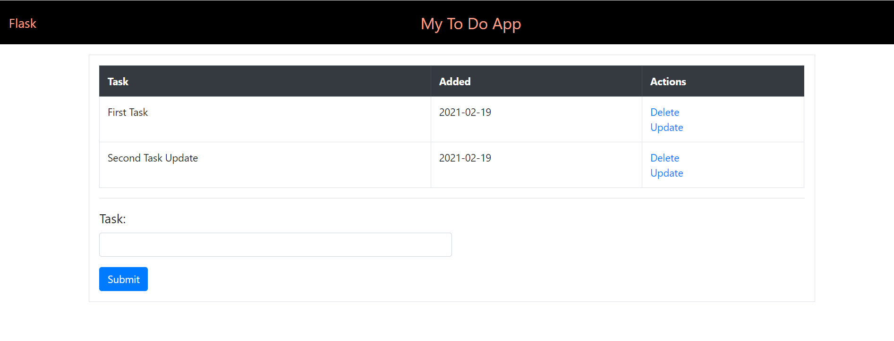
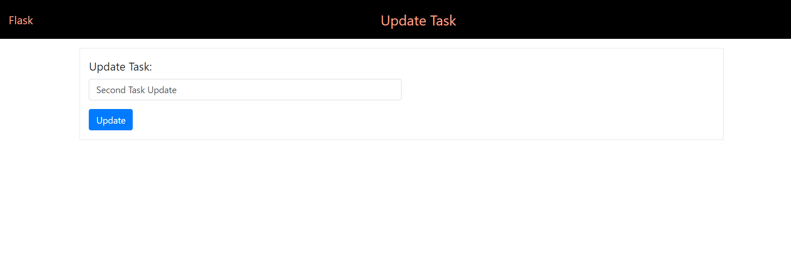

## To Do App using Flask, MongoDB and Boostrap

This is a local application to add, delete and update tasks: 
1. The tasks are stored in a collection in a local standalone MongoDB server. Each task has some content and the date it was created on.
2. The Flask app defines three routes to add, update and delete tasks.
3. The add and update pages have a form to add/update tasks hence the routes defined for them allow both GET and POST requests.
4. The delete and update routes also take in a variable which is the id of the task to delete and update. These ids are passed in the href attribute of the task links using Jinja2.  
5. The templates folder defines the html pages rendered by the app. The index.html and update.html files extend the base.html file. The list of all tasks and the 
task to be updated are passed to these pages using render_template() as keyword arguments and accessed by these pages using Jinja2 templates. 

